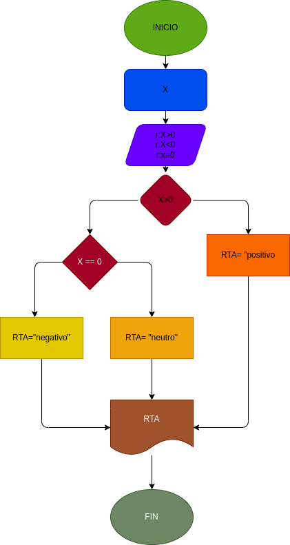

# ejecicio N.5

programa para identificar si un numero es positivo, negativo o 0

# ANALISIS

variable de entrada(input)

X=un numero

variables de proceso y salida(processing, storage, output)

rta=nos va a decir si es positivo o negativo

# DISEÑO

# CONSTRUCCION

usamos lo comparadores para determinar si es positivo o negativo
if x > 0
elif x == 0

## este archivo esta escrito en lenguaje markdown